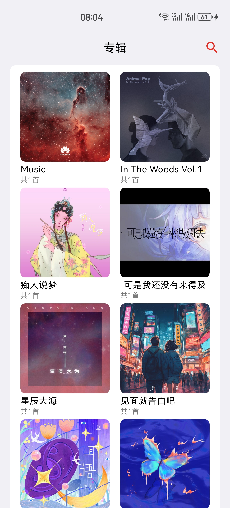
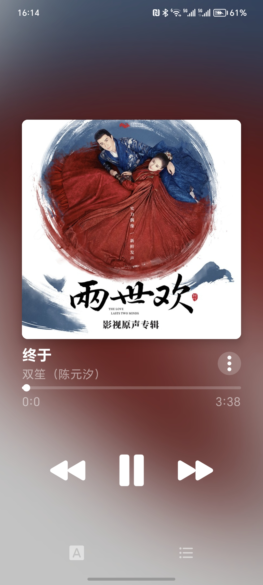
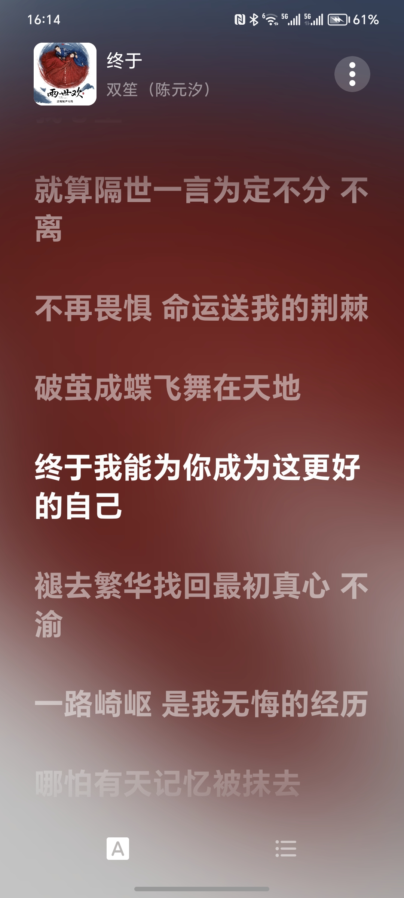
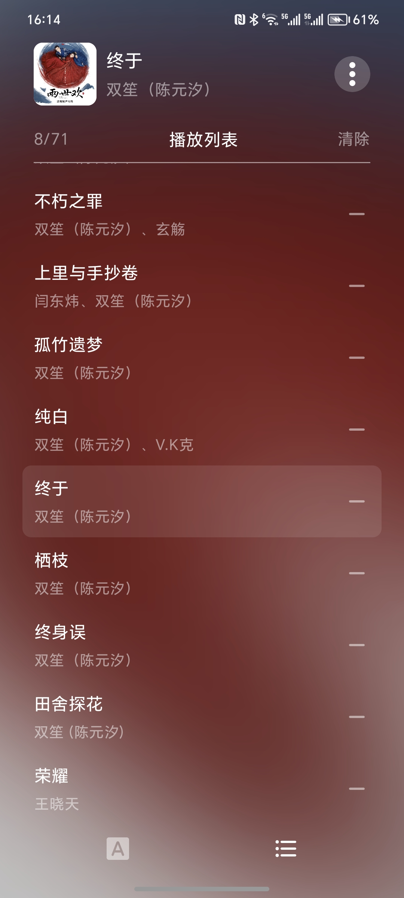

<p align="center"></p>

<p align="center">
    <strong>Hello Star Music!</strong>
    <br>
    <br>

[//]: # (    <a href="https://gitee.com/ZXHHYJ/mandysa_music/wikis">Wiki</a>)
</p>

<p align="center">


<a href="https://gitee.com/ZXHHYJ/star_music/commits/master"></a>
</p>

<br>
<p align="center"><strong>使用Android Compose开发的音乐播放器</strong></p>
<br>

|             媒体库              |             全部专辑             |               歌手               |
|:----------------------------:|:----------------------------:|:------------------------------:|
|  |  |  |

|              播放              |              歌词              |             播放队列              |
|:----------------------------:|:----------------------------:|:-----------------------------:|
|  |  |  |

## 下载地址

|  [Gitee release](https://gitee.com/ZXHHYJ/star_music/releases/) |
|:--:|
| 正式版本 |

## 可以通过提交 issue 来反馈你在Star Music使用中遇到的问题

多问题请分开提交多个 issue

## License

```
Licensed under the Apache License, Version 2.0 (the "License");
you may not use this file except in compliance with the License.
You may obtain a copy of the License at

http://www.apache.org/licenses/LICENSE-2.0

Unless required by applicable law or agreed to in writing, software
distributed under the License is distributed on an "AS IS" BASIS,
WITHOUT WARRANTIES OR CONDITIONS OF ANY KIND, either express or implied.
See the License for the specific language governing permissions and
limitations under the License.
```
